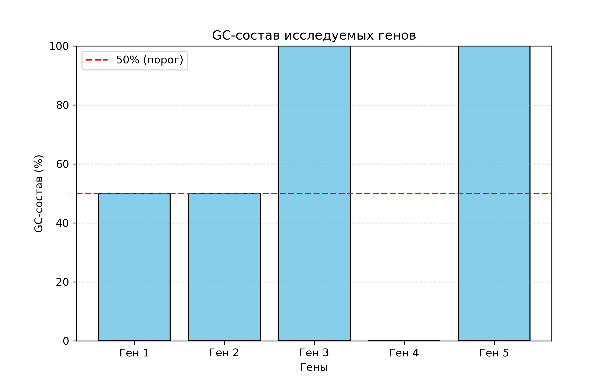

# 🧬 Анализатор GC-состава ДНК

Проект по биоинформатике  
Программа на Python, которая анализирует ДНК-последовательности: считает длину, количество нуклеотидов G и C, вычисляет GC-состав в процентах, строит график и сохраняет результаты в файл.

---

## 📊 Что умеет программа

- Принимает список ДНК-последовательностей
- Считает количество G (гуанин) и C (цитозин)
- Вычисляет GC-состав в процентах
- Строит столбчатый график
- Сохраняет результаты в `results.txt` и график в `gc_plot.png`

---

## 🧪 Пример входных данных

```python
dna_list = ["ATGCGTACGCTAGCT", "AAATTTCCGGG", "GCCGCCGCCGCCGCC"]
```

---

## 📈 Визуализация



---

## 📂 Структура проекта

```
gc_analysis_project/
├── gc_bio_analysis.pynb   # основной код
├── results.txt            # результаты
├── gc_plot.png            # график
└── README.md              # описание
```

---

## 🚀 Запуск

```bash
python gc_analysis_project/gc_bio_analysis.pynb
```

---

## 👩🏼‍🔬 Автор

Полина — студентка 2 курса «Биохимическая инженерия»
